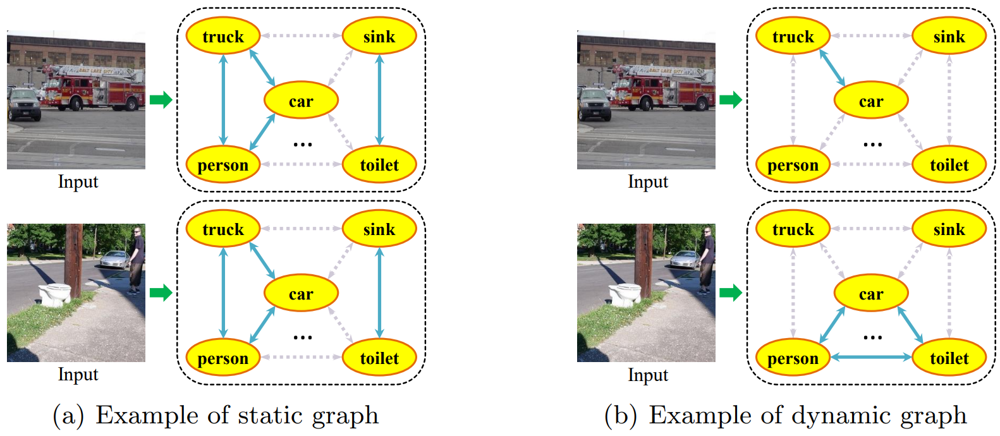
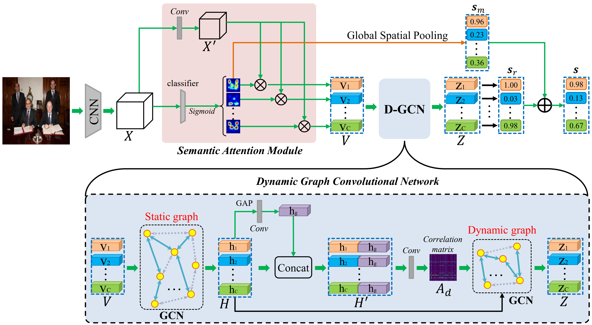
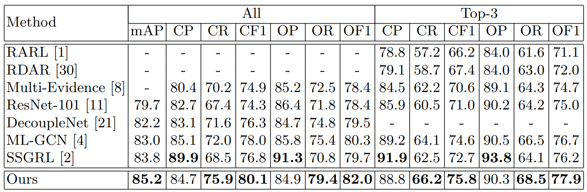
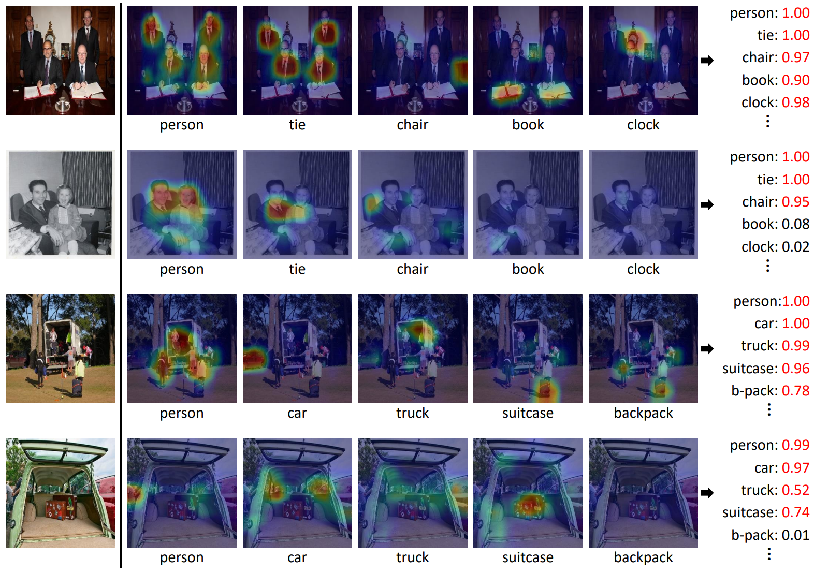

# ADD-GCN
 Official PyTorch implementation of the paper "ADD-GCN: Attention-Driven Dynamic Graph Convolutional Network for Multi-Label Image Recognition" ECCV 2020

## Motivation


## Architecture
Overall framework of ADD-GCN. Given an image, ADD-GCN first uses a CNN backbone to extract convolutional feature maps X. Then, SAM decouples X to content-aware category representations V, and D-GCN models global and local
relations among V to generate the final robust representations Z that contains rich relation information with other categories.



## Results on MS-COCO



## Reproducing result
|DataSet                   | Author | Reproducing |
|:----:                    | :----: | :---------: |
|MS-COCO                   |  85.2  |    85.3     |
|VOC 2007 pretrain on COCO |  96.0  |    96.04    |

The results are reproduced in checkpoints

## Prerequisites

Python 3.8

Pytorch 1.8.1

CUDA 11.6

RTX3090 × 1

## Datasets

- MS-COCO: [train](http://images.cocodataset.org/zips/train2014.zip)  [val](http://images.cocodataset.org/zips/val2014.zip)  [annotations](http://images.cocodataset.org/annotations/annotations_trainval2014.zip)
- VOC 2007: [trainval](http://host.robots.ox.ac.uk/pascal/VOC/voc2007/VOCtrainval_06-Nov-2007.tar)  [test](http://host.robots.ox.ac.uk/pascal/VOC/voc2007/VOCtest_06-Nov-2007.tar)  [test_anno](http://host.robots.ox.ac.uk/pascal/VOC/voc2007/VOCtestnoimgs_06-Nov-2007.tar)

## Train

```
python main.py -d -s -up
```

## Test

```
python main.py -d -s -up -e --resume checkpoint/COCO2014/checkpoint_COCO.pth
```

## Visualization



## Citation

- If you find this work is helpful, please cite the paper

```
@inproceedings{ye2020add,
  title   =  {Attention-Driven Dynamic Graph Convolutional Network for Multi-Label Image Recognition},
  author  =  {Jin Ye, Junjun He, Xiaojiang Peng, Wenhao Wu, Yu Qiao},
  booktitle =  {European Conference on Computer Vision (ECCV)},
  year    =  {2020}
}
```